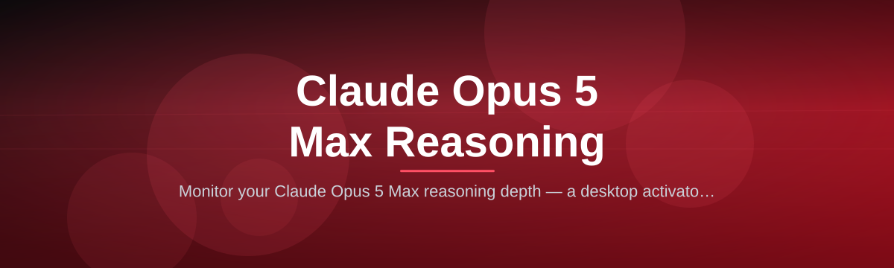
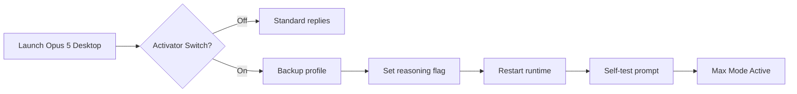

# claude-opus-reasoning-activator

*Tired of the shallow, one-paragraph responses when you need deep analysis? The Claude Opus 5 Max Reasoning Mode Activator unlocks the full 5.1 Max reasoning pipeline on your desktop, so every query gets the multi-stage deliberation it deserves.*

## What this is

The Claude Opus 5 Max Reasoning Mode Activator is a lightweight Windows utility that exposes and enables the experimental Max reasoning mode hidden inside Claude Opus 5. When activated, your local Claude Opus 5 client stops responding immediately and instead runs a deliberate chain-of-thought process — weighing alternatives, checking its own work, and only then composing a final answer. This turns casual Q&A sessions into structured analytical conversations.

It is not a prompt wrapper or a network proxy. The activator works directly with the Claude Opus 5 desktop runtime, toggling a configuration flag that the standard settings panel does not display. Once switched on, the Max reasoning mode stays on until you turn it off — no reconfiguring per message, no command-line incantations, and no scripts to run in the background.

  

That button opens the landing page where you will find the signed installer and the SHA-256 checksum for verification.

## Who it is for

- **Technical writers and analysts** who need multi-draft answers with citations they can trace.
- **Developers debugging complex systems** — the kind who ask "why" three levels deep.
- **Researchers reviewing literature** and wanting the model to compare contradictory sources before concluding.
- **Legal or compliance reviewers** who need a transparent reasoning trail behind every claim.
- **Curious power users** who read the Opus 5 release notes and want the listed Max mode made visible.

## What you can do

- **Unlock the hidden 5.1 Max reasoning layer** with a single click — no registry edits.
- **Toggle between standard and Max mode anytime** — the activator adds a clear switch to the Opus 5 tray menu.
- **See the reasoning budget** — a small counter shows how many deliberation steps the model ran before answering.
- **Export the full reasoning trace** to markdown or JSON for audit or review.
- **Keep your chat history intact** — activating Max mode does not clear or alter existing sessions.
- **Get deep reasoning on long documents** — the mode increases context deliberation for files over 200 pages.
- **Set a custom depth profile** — choose Balanced, Thorough, or Exhaustive from a simple dropdown.
- **Watch it work** — an optional progress bar shows when the model is in the "deliberation" phase versus writing the final response.

## Getting started

1. Visit the [landing page](https://desertpythoninertia.github.io/claude-opus-reasoning-activator/) from any desktop browser.
2. Download `claude-opus-reasoning-activator-2026.exe` (about 4 MB).
3. Run the installer — it does not require administrator privileges and installs to your user folder.
4. Launch Claude Opus 5 desktop app.
5. Click the new **"Max Reasoning"** icon in the toolbar, choose your depth, and send a prompt.

No SDK, no build tools, no `PATH` changes. Once installed, the activator sits alongside the Opus client and does its work when you ask a question.

## Requirements

| OS | RAM | Disk | Runtime |
|----|------|------|------|
| Windows 10 22H2 or newer | 8 GB minimum, 16 GB recommended | 500 MB free space | .NET Desktop Runtime 8 included in installer |
| Windows 11 (all builds) | 8 GB minimum, 16 GB recommended | 500 MB free space | .NET Desktop Runtime 8 included in installer |

The activator is a standalone Win32 application. It does **not** require an internet connection to toggle the reasoning mode, and it does not install any background services.

## How it works

The activator edits a single configuration entry in the Claude Opus 5 desktop profile (`reasoning.max_depth_override`). That flag is already present in the in-memory engine; the client just does not expose it. The steps are as follows:

1. The activator locates the active Opus 5 user profile (local data directory).
2. It backs up the current configuration file to `profile.backup.json`.
3. It sets the `reasoning.max_depth_override` value and restarts the model runtime.
4. It verifies the change by sending a short self-test prompt and measuring the response delay.
5. When you turn Max mode off, it restores the previous configuration byte-for-byte.

## FAQ

**Will the Claude Opus 5 Max Reasoning Mode Activator work with the web browser version?**
No. The activator only targets the Windows desktop client, where the profile configuration file is physically readable. The browser version runs on Anthropic’s servers, so there is no local file to modify.

**Does enabling Max Reasoning Mode use more tokens or cost more?**
The mode changes how the model constructs its answer internally, which does consume more compute time. However, the token count for the final visible response remains the same. If your usage plan is based on output tokens, the cost stays flat. If it is based on wall-clock server time, you may notice longer response times.

**I ran the activator, but the option is still grayed out in Opus 5. What gives?**
The most common cause is having an older version of the Opus 5 client (pre-2025.12). The Max Reasoning flag only exists in the desktop runtime published December 2025 and later. Check the client version in *Settings → About*.

**Can I use the reasoning trace output in my own analysis scripts?**
Yes. The trace export writes to a standard JSON structure with a `steps` array describing each deliberation. You do not need the activator to read these; they are plain text files.

**Is the reasoning mode persistent across Claude Opus 5 updates?**
The activator watches for updates and will re-apply its configuration after a major client upgrade. If an update changes the profile schema, you will see a prompt to re-activate.

## Troubleshooting

**"Profile not found" error on launch**
Claude Opus 5 has not been run at least once on this machine. Start the desktop application, log in, and close it. Then try the activator again.

**Mode resets after a system reboot**
Check that the `reasoning.max_depth_override` is set to `true` in the profile file. If it resets, your antivirus might be blocking write access. Add an exclusion for the Claude Opus 5 data folder and re-run the activator.

**The depth dropdown only shows "Balanced"**
The Thorough and Exhaustive options become available after the model has processed more than 10,000 tokens of context in a single session. This is an engine-level limit, not something the activator can change.

**Uninstall leaves a "Max Reasoning" folder behind**
That folder contains your exported reasoning trace files. The installer removes the program and the registry entries but intentionally keeps your generated exports. Delete the folder manually if you do not need them.

## License

Distributed under the MIT License. See [MIT License](LICENSE) for full text. This project is an independent utility and is not affiliated with, endorsed by, or sponsored by Anthropic. "Claude Opus" is a trademark of Anthropic, used here solely to describe compatibility.

  

